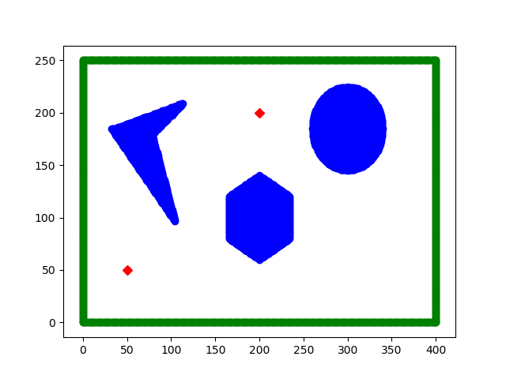
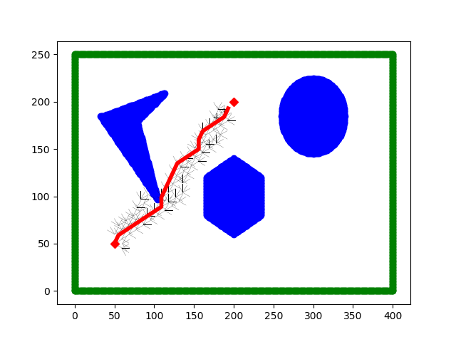

# ENPM661-A_Star
* Implementation of A Start algorithm for a Rigid Robot
By - Venkata Sri Ranga Sai Anapu (118529950) and Hemanth Joseph Raj (117518955)

* Files required in the source directory:
     1 Astar_rigid.py
     2 Finalmap.py
     3 Functions.py

* Set the User Defined Co-ordinates Flag in 'Astar_rigid.py'
    "True= User inputs the initial and goal configuration".
    "False- Pre-defined initial and goal configuration".

* Input arguements-
    1) Input Start point x co-ordinate
    2) Input Start point y co-ordinate
    3) Input Goal point x co-ordinate 
    4) Input Goal point y co-ordinate 
    5) Entre Clearance
    6) Enter Radius of the robot
    6) Input Threshold     
    7) Input Sept size (L)

* Download the zip into a folder of choice and Unzip it
* Open all the files in any IDE of choice (preferably VS Code)
* Run the Astar_rigid.py from the IDE

* Time Taken to run the code: approx 100 seconds (varies based on laptop specifications)

* Github Link: https://github.com/HemanthJoseph/ENPM661-A_Star.git

* Initial Map of the Environment
* 

* Final Map after path planning using A* algorithm
* 
